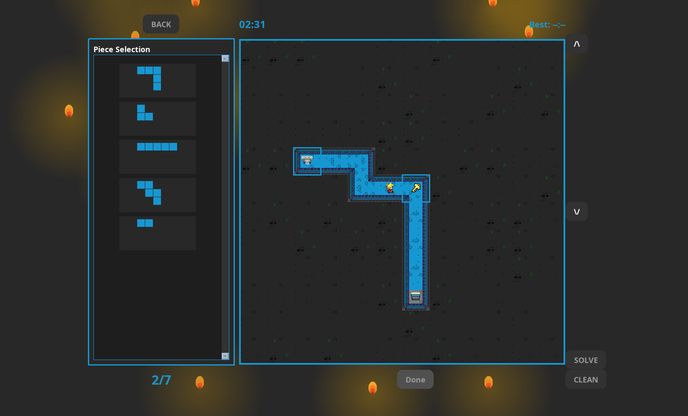

# DungeonExit

## About the Game

**DungeonExit** is an engaging puzzle game where players must strategically place pieces on a board to forge a path through treacherous dungeons!



### The Adventure

You find yourself trapped in a mysterious dungeon with only your wits to guide you. Armed with a collection of puzzle pieces, you must create a pathway that connects all objectives in the right sequence to escape:

1. Start at the **ENTRY** point
2. Find the **KEY** to unlock the treasure chest
3. Open the **CHEST** to retrieve the legendary sword
4. Defeat the fearsome **DRAGON** with your newly acquired weapon
5. Escape through the **EXIT**

### Features

- **Multi-level Dungeons**: Some challenges span multiple boards connected by **STAIRS**
- **Multiplayer Mode**: Challenge your friends in the same dungeon, each with your own bag of pieces and objectives

## Prerequisites

- **Java Development Kit (JDK) 21 or higher**: This project utilizes features introduced in Java 21, such as the `getLast()` and `removeLast()` methods in `ArrayList`. Ensure that your development environment is configured to use JDK 21 or a more recent version.

## How to Compile the Project

### Manually

Ensure that your environment is set to use JDK 21 or higher. You can check your Java version with:

```sh
java -version
```

Compile and run the project with the following commands:

```sh
javac DungeonExit/src/**/*.java -d bin/class
cd DungeonExit
java -cp .:../bin/class:res main.Main # For Windows, replace ':' with ';'
```

### With the Shell Script on UNIX-Based OS

```sh
chmod +x build.sh
./build.sh
```

### With the Batch Script for Windows Users

```sh
run.bat
```

## Authors

This project is being developed by:

- **Florian CASALTA VINCENT**
- **Theo POLGAR**
- **Iyan NAZARIAN**